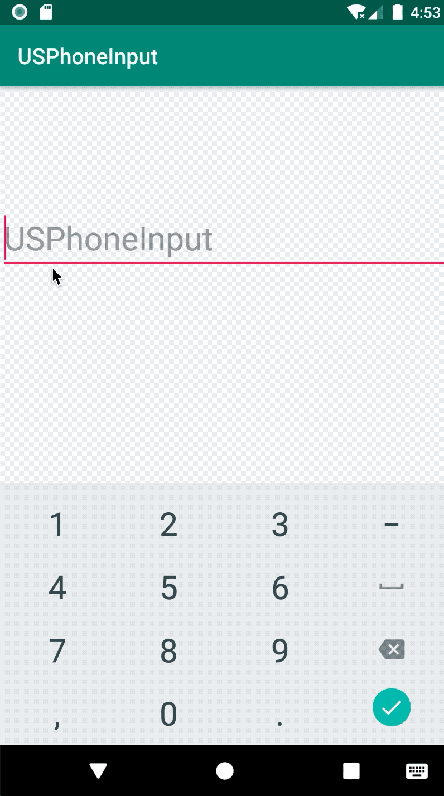
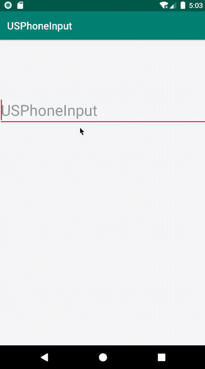

# USPhoneInput
Phone Input EditText for US numbers `(XXX) XXX-XXXX`

[  ](https://bintray.com/chinalwb/usphoneinput/usphoneinput/1.0/link)

## Features
1. Auto format user input numbers as US phone number format, like (888) 888-1119
2. Support paste phone number and format the content as US phone number
3. Phone number re-edit will format the content as US phone number automatically

## Features demo


Check points:
1. [x] Normal input a valid phone number
2. [x] Normal delete a digt
3. [x] Don't allow to delete a non-digit
4. [x] Delete the number before a non-digit will re-format the content 
5. [x] Try to input a number at the very beginning will put the input digit after '(' 




Check points:
1. [x] Paste more characters than a valid phone number length, but contains a valid phone number
2. [x] Paste a valid phone number
3. [x] Paste less characters than a valid phone number length

## How to use

1. In build.gradle:
```
implementation 'com.github.chinalwb:usphoneinput:1.0'
```
2. In your layout XML, refer to `com.chinalwb.usphoneinput.USPhoneInputEditText` like below:
```
<com.chinalwb.usphoneinput.USPhoneInputEditText
        android:id="@+id/phone_edit"
        android:layout_width="match_parent"
        android:layout_height="wrap_content"
        android:textColor="@color/colorAccent"
        android:hint="USPhoneInput"
        android:textSize="30sp"
        />
```
3. If you need an implementation in java (rather than Kotlin, probably you're still using android support library but not ready yet for migrating to androidx), copy `com.chinalwb.usphoneinput.injava.USPhoneInputEditText` into your project directly, and refer to this view in your layout xml.


## Thank you
This project is using [libphonenumber-android](https://github.com/MichaelRocks/libphonenumber-android) for validating if the input is a valid US phone number.


----------

MIT License

Copyright (c) 2019 Rain Liu

Permission is hereby granted, free of charge, to any person obtaining a copy of this software and associated documentation files (the "Software"), to deal in the Software without restriction, including without limitation the rights to use, copy, modify, merge, publish, distribute, sublicense, and/or sell copies of the Software, and to permit persons to whom the Software is furnished to do so, subject to the following conditions:

The above copyright notice and this permission notice shall be included in all copies or substantial portions of the Software.

THE SOFTWARE IS PROVIDED "AS IS", WITHOUT WARRANTY OF ANY KIND, EXPRESS OR IMPLIED, INCLUDING BUT NOT LIMITED TO THE WARRANTIES OF MERCHANTABILITY, FITNESS FOR A PARTICULAR PURPOSE AND NONINFRINGEMENT. IN NO EVENT SHALL THE AUTHORS OR COPYRIGHT HOLDERS BE LIABLE FOR ANY CLAIM, DAMAGES OR OTHER LIABILITY, WHETHER IN AN ACTION OF CONTRACT, TORT OR OTHERWISE, ARISING FROM, OUT OF OR IN CONNECTION WITH THE SOFTWARE OR THE USE OR OTHER DEALINGS IN THE SOFTWARE.
